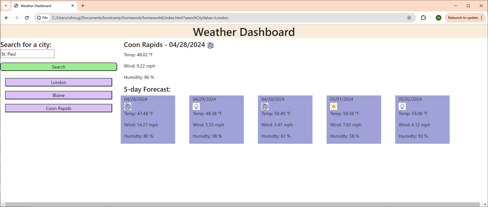

# Weather Dashboard

# Links 
- Deployment URL: https://whougie.github.io/search-city-temperature/
- GitHub URL: https://github.com/whougie/search-city-temperature.git

# Description
Displays the current and 5-day forecast for the search city.  The search city can either be inserted into the search bar or the search history buttons can be used for the city.  The forecast will contain the temperature, weather icon, wind, and humidty.  The website allows a max of 6 cities for the city search history.

The city used for forecast comes from either the search bar or the search history city buttons:

